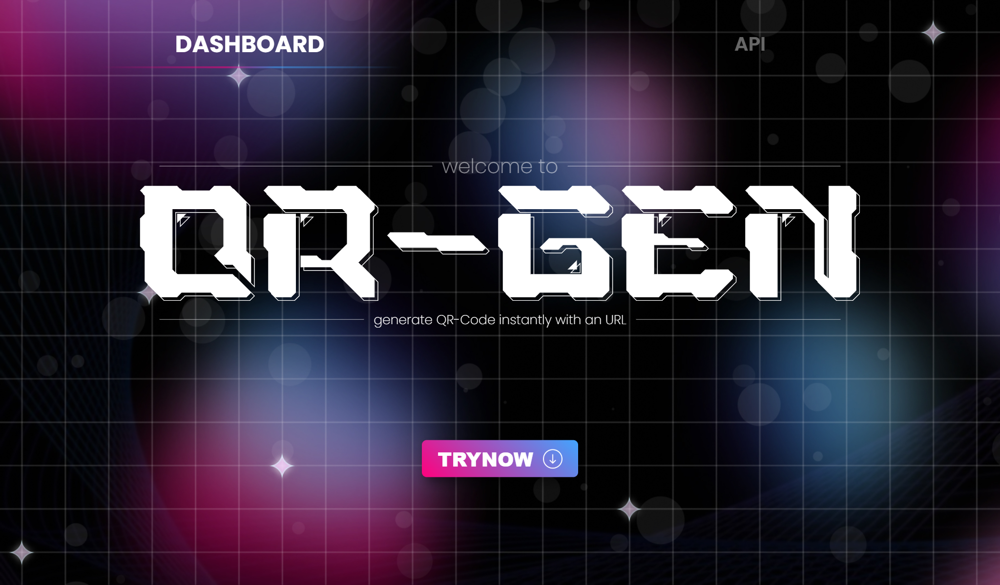

# 📦 QR-Gen

A customizable QR code generator with flexible options for color themes and optional logo insertion. Built with a modern tech stack and optimized for performance and clarity.

## 🖌️ Design

View the full design inspiration or wireframe 👉 *[Add Figma or image link here]*

## 🧠 Overview

**QR-Gen** is a powerful, minimalistic **QR code generator** built with **React (TypeScript) + Vite** on the frontend, and a **TypeScript/Python**-powered backend. It gives users full control over the appearance and branding of generated QR codes.

## ✨ Features

- 🎨 Customize **background color** and **QR line color**
- 🖼️ Optionally **insert a logo** into the QR code
- 🧪 Real-time QR code preview
- 🔁 Instant regeneration on change
- 📱 Responsive design, works seamlessly across devices

## ⚙️ Tech Stack

- **Frontend**: React (TypeScript) + Vite
- **Backend**: TypeScript + Python
- **Styling**: CSS
- **Deployment**: Vercel

## 🌐 API

- 🚫 Coming soon
